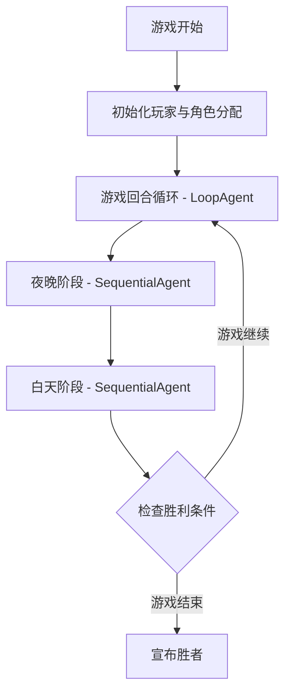
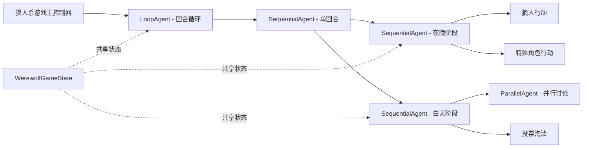

# 狼人杀多 Agent 游戏工作流设计

## 项目概述

基于 Spring AI Alibaba Agent Framework 实现一个 9 人玩家版本的狼人杀游戏工作流。该系统通过 LoopAgent、ParallelAgent 和 SequentialAgent 的组合编排，模拟狼人杀游戏的完整流程，包括角色分配、夜晚行动、白天讨论和投票等环节。

### 设计目标

- 利用 Spring AI Alibaba 的 Agent 编排能力实现游戏逻辑
- 通过 OverAllState 实现多 Agent 之间的状态共享与同步
- 使用 LoopAgent 实现游戏的多回合循环控制
- 利用 ParallelAgent 实现玩家并行发言和讨论
- 通过 SequentialAgent 编排夜晚和白天阶段的顺序执行
- 支持灵活的发言顺序策略（顺序、逆序、随机位置开始）
- **创造真实沉浸的狼人杀游戏体验，优先考虑游戏质量而非性能优化**

### 技术约束

- 基于 Spring AI Alibaba Agent Framework 的静态编排设计
- 固定 9 人局配置：3 狼 + 1 预言家 + 1 女巫 + 1 猎人 + 3 村民
- 不实现警长机制
- 不考虑狼人自爆功能
- 每个回合需根据存活玩家动态重建 Agent 列表
- 使用 OverAllState 作为全局状态容器，在 Agent 间传递游戏数据
- 使用 OpenAI 标准模型接口作为 LLM 后端

## 系统架构

### 整体架构流程



### 核心组件关系



## 游戏规则设计

### 固定板子配置

本设计固定使用 9 人标准板子，不支持其他角色组合：

- **3 个狼人**：夜晚协商杀人
- **1 个预言家**：每晚查验一名玩家身份
- **1 个女巫**：拥有解药和毒药各一瓶
- **1 个猎人**：被投票淘汰时可开枪带走一名玩家
- **3 个村民**：通过投票找出狼人

### 不包含的功能

- **警长机制**：不设置警长选举和警徽传递
- **狼人自爆**：狼人不能主动自爆跳过发言阶段
- **连麦/遗言**：被淘汰玩家不留遗言
- **首日平安夜**：第一晚可能发生死亡

### 发言顺序机制

白天讨论阶段的发言顺序采用灵活策略，每个回合随机确定：

**发言顺序策略：**

1. **随机起始位置**：从存活玩家中随机选择一个索引作为发言起始位置
2. **随机发言方向**：随机选择顺序（forward）或逆序（backward）
3. **按序发言**：从起始位置开始，按选定方向依次发言

**示例场景：**

存活玩家：["Alice", "Bob", "Charlie", "David", "Eve"]

- **场景1**：起始索引 = 2，方向 = forward
  - 发言顺序：Charlie → David → Eve → Alice → Bob

- **场景2**：起始索引 = 3，方向 = backward
  - 发言顺序：David → Charlie → Bob → Alice → Eve

- **场景3**：起始索引 = 0，方向 = forward
  - 发言顺序：Alice → Bob → Charlie → David → Eve

**实现要点：**

- 每个白天阶段开始时生成发言顺序
- 发言顺序存储在 OverAllState 的 speechOrder 字段
- 虽然 ParallelAgent 并行生成发言内容，但在展示时按 speechOrder 排序
- 发言顺序信息会传递给后续的投票 Agent 作为参考

### 人机交互模式

通过环境变量 `WEREWOLF_HUMAN_PLAYER_ENABLED` 控制游戏模式：

**全 Agent 模式（默认）：**

- 环境变量值：`false` 或未设置
- 所有 9 个玩家均由 ReactAgent 控制
- 完全自动化运行，无需人类干预

**人机交互模式：**

- 环境变量值：`true`
- 通过 `WEREWOLF_HUMAN_PLAYER_NAME` 指定人类玩家控制的角色名称（如 "Alice"）
- 该玩家的行动通过 Human In The Loop 机制实现
- 其余 8 个玩家由 ReactAgent 控制

**人类玩家交互点：**

1. **夜晚阶段**：如果人类玩家是特殊角色（狼人/预言家/女巫/猎人），需要输入行动决策
2. **白天发言**：人类玩家轮到发言时，等待输入发言内容
3. **投票阶段**：所有玩家统一由系统处理（基于发言内容自动投票）

**实现方式：**

- 为人类玩家创建带有 Human In The Loop 配置的特殊 Agent
- 该 Agent 在执行时会暂停并等待人类输入
- 其他 Agent 正常运行

| 字段名称 | 数据类型 | 说明 | 示例值 |
|---------|---------|------|--------|
| alivePlayers | List&lt;String&gt; | 存活玩家名称列表 | ["Alice", "Bob", "Charlie"] |
| allPlayers | List&lt;String&gt; | 所有玩家名称列表（含已淘汰） | ["Alice", "Bob", "Charlie", "David"] |
| playerRoles | Map&lt;String, String&gt; | 玩家角色映射表 | {"Alice": "werewolf", "Bob": "seer"} |
| currentRound | Integer | 当前回合数 | 3 |
| firstDay | Boolean | 是否为第一个白天 | false |
| nightKilledPlayer | String | 夜晚被狼人杀害的玩家 | "Charlie" |
| witchSavedPlayer | String | 女巫救治的玩家 | "Charlie" |
| witchPoisonedPlayer | String | 女巫毒杀的玩家 | null |
| seerCheckedPlayer | String | 预言家查验的玩家 | "Bob" |
| seerCheckResult | String | 查验结果 | "werewolf" |
| votedOutPlayer | String | 白天投票淘汰的玩家 | "Alice" |
| hunterShotPlayer | String | 猎人开枪带走的玩家 | null |
| daySpeeches | Map&lt;String, String&gt; | 白天玩家发言内容 | {"Alice": "我认为Bob是狼人"} |
| speechOrder | List&lt;String&gt; | 当前回合发言顺序 | ["Alice", "Charlie", "Bob", ...] |
| speechStartIndex | Integer | 发言起始位置索引 | 2 |
| speechDirection | String | 发言方向（"forward" 或 "backward"） | "forward" |

### 角色类型定义

| 角色标识 | 角色名称 | 阵营 | 特殊能力 |
|---------|---------|------|---------|
| werewolf | 狼人 | 狼人阵营 | 每晚可与其他狼人协商并投票杀害一名玩家 |
| villager | 村民 | 好人阵营 | 无特殊能力，通过投票找出狼人 |
| seer | 预言家 | 好人阵营 | 每晚可查验一名玩家的真实身份 |
| witch | 女巫 | 好人阵营 | 拥有解药（救人）和毒药（杀人）各一瓶 |
| hunter | 猎人 | 好人阵营 | 被投票淘汰时可开枪带走一名玩家 |

## 工作流设计

### 游戏主循环流程

游戏通过 LoopAgent 实现多回合循环，循环条件为游戏未结束（即存在狼人且存在村民）。

**循环控制策略：**

- 策略类型：LoopMode.condition
- 终止条件：检查 OverAllState 中的胜利条件标志
  - 狼人阵营获胜：所有好人被淘汰
  - 好人阵营获胜：所有狼人被淘汰

**回合流程：**

1. 回合初始化：更新回合计数器
2. 执行夜晚阶段（NightPhaseAgent）
3. 执行白天阶段（DayPhaseAgent）
4. 检查胜利条件
5. 更新存活玩家列表

### 夜晚阶段工作流

夜晚阶段使用 SequentialAgent 串行执行各个特殊角色的行动。

#### 夜晚阶段流程图

```mermaid
sequenceDiagram
    participant Loop as 游戏循环
    participant Night as 夜晚阶段Agent
    participant Werewolf as 狼人行动Agent
    participant Witch as 女巫行动Agent
    participant Seer as 预言家行动Agent
    participant State as OverAllState
    
    Loop->>Night: 进入夜晚阶段
    Night->>Werewolf: 执行狼人讨论与投票
    Werewolf->>State: 更新 nightKilledPlayer
    Night->>Witch: 执行女巫行动
    Witch->>State: 更新救人/毒人决策
    Night->>Seer: 执行预言家查验
    Seer->>State: 更新查验结果
    Night->>Loop: 夜晚阶段结束
```

#### 狼人行动子流程

**Agent 类型：** ParallelAgent + SequentialAgent（多狼人真实讨论）

**工作模式：**

为了更贴近真实狼人杀场景，狼人夜晚行动采用多 Agent 协作模式：

1. **狼人内部讨论阶段（ParallelAgent）**
   - 为每个存活的狼人创建独立的 ReactAgent
   - 每个狼人 Agent 并行生成自己的观点和杀人建议
   - 输入：存活玩家列表、白天发言分析、其他狼人身份
   - 输出：推荐击杀目标、理由、对其他狼人的建议

2. **狼人达成一致阶段（ReactAgent）**
   - 综合所有狼人的讨论内容
   - 模拟狼人团队最终决策过程
   - 输出：最终击杀目标、决策理由

**讨论深度增强：**
- 每个狼人 Agent 会分析白天的发言，判断谁可能是预言家、女巫等关键角色
- 狼人之间会就击杀策略进行辩论（优先杀神职还是刀边缘人）
- 考虑第二天如何配合发言、如何污染预言家等策略

**输出格式：**

| 字段名 | 类型 | 说明 |
|-------|------|------|
| targetPlayer | String | 被选中的目标玩家名称 |
| reason | String | 选择该玩家的理由 |

#### 女巫行动子流程

**Agent 类型：** ReactAgent

**工作模式：**

- 输入：被狼人杀害的玩家、女巫剩余药水状态
- 处理：LLM 决定是否使用解药或毒药
- 输出：行动决策（结构化 JSON）

**输出格式：**

| 字段名 | 类型 | 说明 |
|-------|------|------|
| useAntidote | Boolean | 是否使用解药 |
| savedPlayer | String | 救治的玩家（如果使用解药） |
| usePoison | Boolean | 是否使用毒药 |
| poisonedPlayer | String | 毒杀的玩家（如果使用毒药） |

#### 预言家查验子流程

**Agent 类型：** ReactAgent

**工作模式：**

- 输入：存活玩家列表、历史查验记录
- 处理：LLM 选择一名玩家进行身份查验
- 输出：查验目标和结果（结构化 JSON）

**输出格式：**

| 字段名 | 类型 | 说明 |
|-------|------|------|
| checkedPlayer | String | 被查验的玩家名称 |
| isWerewolf | Boolean | 查验结果（是否为狼人） |

### 白天阶段工作流

白天阶段使用 SequentialAgent 编排讨论和投票两个子阶段。

#### 白天阶段流程图

```mermaid
sequenceDiagram
    participant Loop as 游戏循环
    participant Day as 白天阶段Agent
    participant Discussion as 讨论阶段ParallelAgent
    participant P1 as 玩家1 Agent
    participant P2 as 玩家2 Agent
    participant PN as 玩家N Agent
    participant Voting as 投票Agent
    participant State as OverAllState
    
    Loop->>Day: 进入白天阶段
    Day->>Discussion: 玩家并行发言
    par 并行执行
        Discussion->>P1: 生成发言内容
        Discussion->>P2: 生成发言内容
        Discussion->>PN: 生成发言内容
    end
    P1-->>State: 发言内容1
    P2-->>State: 发言内容2
    PN-->>State: 发言内容N
    Discussion->>Day: 合并所有发言
    Day->>Voting: 执行投票
    Voting->>State: 更新 votedOutPlayer
    Day->>Loop: 白天阶段结束
```

#### 讨论阶段子流程

**Agent 类型：** ParallelAgent（包含多个 ReactAgent 子 Agent）

**工作模式：**

- 为每个存活玩家动态创建一个 ReactAgent
- 所有玩家 Agent 并行生成发言内容
- 使用 ListMergeStrategy 合并所有发言
- 根据预先生成的 speechOrder 对发言进行排序展示

**发言顺序生成流程：**

1. 获取存活玩家列表（如：["Alice", "Bob", "Charlie", "David", "Eve"]）
2. 随机生成起始索引（0 到玩家数量-1）
3. 随机选择发言方向（"forward" 或 "backward"）
4. 根据起始索引和方向生成发言顺序列表
5. 将发言顺序存储到 OverAllState 的 speechOrder 字段

**发言顺序生成算法：**

```
输入：alivePlayers = ["Alice", "Bob", "Charlie", "David", "Eve"]

步骤1：随机起始索引 startIndex = random(0, 4)  // 假设结果为 2
步骤2：随机方向 direction = random("forward", "backward")  // 假设结果为 "forward"

步骤3：生成发言顺序
if direction == "forward":
    speechOrder = alivePlayers[startIndex:] + alivePlayers[:startIndex]
    // 结果：["Charlie", "David", "Eve", "Alice", "Bob"]
else:  // backward
    // 从 startIndex 开始逆序
    part1 = reverse(alivePlayers[:startIndex+1])  // ["Charlie", "Bob", "Alice"]
    part2 = reverse(alivePlayers[startIndex+1:])  // ["Eve", "David"]
    speechOrder = part1 + part2
    // 结果：["Charlie", "Bob", "Alice", "Eve", "David"]

步骤4：存储到状态
state.update("speechOrder", speechOrder)
state.update("speechStartIndex", startIndex)
state.update("speechDirection", direction)
```

**子 Agent 配置：**

- 名称：{playerName}_discuss
- 输入：
  - 玩家角色和身份信息
  - 夜晚事件信息（死亡情况）
  - 历史所有回合的发言记录
  - 发言顺序和位置
  - 其他玩家的行为模式分析
- 指令：根据角色身份和已知信息进行深度推理和策略发言
- 输出键：{playerName}_speech

**发言内容增强：**
- 好人阵营：分析逻辑链、推理狼人身份、呼吁其他玩家配合
- 狼人阵营：构建假身份、混淆视听、引导投票方向
- 神职角色：决定是否跳身份、如何传递信息而不暴露
- 每个玩家的发言应体现个性化的推理风格和策略

**合并与排序策略：**

- 使用 ListMergeStrategy 收集所有发言
- 根据 speechOrder 对发言进行排序
- 按序展示发言内容（用于日志输出和前端显示）
- 将完整的发言集合传递给投票 Agent

**投票阶段子流程**

**Agent 类型：** ReactAgent

**工作模式：**

- 输入：所有玩家的发言内容（按 speechOrder 排序）、存活玩家列表
- 处理：LLM 基于发言内容模拟投票过程
- 输出：被投票淘汰的玩家及投票详情

**输出格式：**

| 字段名 | 类型 | 说明 |
|-------|------|------|
| votedOutPlayer | String | 被投票淘汰的玩家 |
| voteDetails | Map&lt;String, String&gt; | 每个玩家的投票对象 |
| voteCount | Map&lt;String, Integer&gt; | 每个玩家获得的票数 |

**注意事项：**

- 投票阶段完全由 LLM 处理
- 投票结果需考虑发言顺序的影响（后发言者可能更具说服力）

### 发言顺序生成 Agent

**功能说明：**

在白天讨论阶段开始前，需要先生成本回合的发言顺序。该功能可以通过一个简单的 ReactAgent 或直接在代码中实现。

**实现方式1：代码直接实现（推荐）**

在白天阶段 SequentialAgent 之前，直接执行发言顺序生成逻辑：

```
流程：
1. 从 OverAllState 获取 alive_players
2. 随机生成 startIndex 和 direction
3. 计算 speechOrder
4. 将 speechOrder, startIndex, direction 写入 OverAllState
```

**实现方式2：使用 ReactAgent**

创建一个专门的 ReactAgent 用于生成发言顺序：

```
ReactAgent speechOrderAgent = ReactAgent.builder()
    .name("speech_order_generator")
    .description("生成白天讨论的发言顺序")
    .instruction("根据存活玩家列表，随机选择起始位置和方向，生成发言顺序")
    .outputSchema("""
        {
            "speechOrder": ["玩家1", "玩家2", ...],
            "startIndex": 起始索引,
            "direction": "forward" 或 "backward"
        }
    """)
    .outputKey("speech_order_info")
    .build();
```

**输出示例：**

```json
{
    "speechOrder": ["Charlie", "David", "Eve", "Alice", "Bob"],
    "startIndex": 2,
    "direction": "forward"
| speechOrder | List&lt;String&gt; | REPLACE | 当前回合发言顺序 |
| speechStartIndex | Integer | REPLACE | 发言起始位置索引 |
| speechDirection | String | REPLACE | 发言方向 |
| day_speeches | Map&lt;String, String&gt; | REPLACE | 白天发言内容 |
| voted_out_player | String | REPLACE | 投票淘汰的玩家 |

## Agent 设计规范

### 玩家 Agent 抽象设计

虽然不直接继承 ReactAgent 创建 PlayerAgent 类，但需要为每个玩家创建独立的 ReactAgent 实例。

**Agent 配置模板：**

| 配置项 | 配置方式 | 说明 |
|-------|---------|------|
| name | {playerName} | 玩家唯一标识符 |
| description | "玩家 {playerName}，角色: {role}" | Agent 功能描述 |
| instruction | 根据角色生成指令文本 | 角色行为指导 |
| outputKey | {playerName}_action | 输出结果的存储键 |
| model | 共享的 ChatModel 实例 | LLM 模型 |

**角色指令映射表：**

| 角色 | 指令文本 |
|-----|---------|
| werewolf | 你是狼人，需要与其他狼人合作消灭村民。你的目标是隐藏身份，误导好人，并在夜晚选择合适的目标。 |
| seer | 你是预言家，每晚可以查验一名玩家的身份。你需要谨慎选择查验对象，并巧妙地引导好人找出狼人。 |
| witch | 你是女巫，拥有解药和毒药各一瓶。你需要根据局势判断何时使用药水，最大化好人阵营的优势。 |
| hunter | 你是猎人，被投票出局时可以开枪带走一名玩家。你需要保护自己并在关键时刻使用技能。 |
| villager | 你是村民，需要通过逻辑推理找出狼人。虽然没有特殊能力，但你的投票权同样重要。 |

### 人机交互 Agent 设计

当环境变量 `WEREWOLF_HUMAN_PLAYER_ENABLED=true` 时，系统需要为人类玩家创建特殊的 Agent。

#### Human In The Loop 集成

**人类玩家 Agent 配置：**

```
配置项说明：
- 名称：从环境变量 WEREWOLF_HUMAN_PLAYER_NAME 获取（如 "Alice"）
- 角色：按正常流程分配（可能是任意角色）
- HITL 钩子：在 Agent 执行前触发，等待人类输入
- 输入方式：控制台输入或 WebSocket 接口
```

**交互流程设计：**

**夜晚阶段交互：**

1. 如果人类玩家是狼人
   - 系统展示其他狼人的讨论内容
   - 等待人类玩家输入目标选择
   - 将人类输入作为 Agent 输出

2. 如果人类玩家是预言家
   - 系统提示存活玩家列表
   - 等待人类玩家选择查验目标
   - 返回查验结果

3. 如果人类玩家是女巫
   - 系统展示夜晚死亡信息和药水状态
   - 等待人类玩家决定是否使用药水
   - 记录药水使用情况

4. 如果人类玩家是猎人或村民
   - 夜晚无行动，跳过

**白天阶段交互：**

1. 发言阶段
   - 当轮到人类玩家发言时（根据 speechOrder）
   - 系统暂停并展示已有发言
   - 等待人类玩家输入发言内容
   - 继续后续流程

2. 投票阶段
   - 投票由系统统一处理（基于所有发言内容）
   - 人类玩家的投票也由 LLM 基于其发言推断

**实现方式：**

- 使用 Spring AI Alibaba Agent Framework 的 Hook 机制
- 在 Agent 执行前注入 `HumanInTheLoopHook`
- Hook 触发时暂停执行，等待外部输入
- 输入方式可以是控制台、HTTP API 或 WebSocket

### 人机交互 Agent 设计

当环境变量 `WEREWOLF_HUMAN_PLAYER_ENABLED=true` 时，系统需要为人类玩家创建特殊的 Agent。

#### Human In The Loop 集成

**人类玩家 Agent 配置：**

```
配置项说明：
- 名称：从环境变量 WEREWOLF_HUMAN_PLAYER_NAME 获取（如 "Alice"）
- 角色：按正常流程分配（可能是任意角色）
- HITL 钩子：在 Agent 执行前触发，等待人类输入
- 输入方式：控制台输入或 WebSocket 接口
```

**交互流程设计：**

**夜晚阶段交互：**

1. 如果人类玩家是狼人
   - 系统展示其他狼人的讨论内容
   - 等待人类玩家输入目标选择
   - 将人类输入作为 Agent 输出

2. 如果人类玩家是预言家
   - 系统提示存活玩家列表
   - 等待人类玩家选择查验目标
   - 返回查验结果

3. 如果人类玩家是女巫
   - 系统展示夜晚死亡信息和药水状态
   - 等待人类玩家决定是否使用药水
   - 记录药水使用情况

4. 如果人类玩家是猎人或村民
   - 夜晚无行动，跳过

**白天阶段交互：**

1. 发言阶段
   - 当轮到人类玩家发言时（根据 speechOrder）
   - 系统暂停并展示已有发言
   - 等待人类玩家输入发言内容
   - 继续后续流程

2. 投票阶段
   - 投票由系统统一处理（基于所有发言内容）
   - 人类玩家的投票也由 LLM 基于其发言推断

**实现方式：**

- 使用 Spring AI Alibaba Agent Framework 的 Hook 机制
- 在 Agent 执行前注入 `HumanInTheLoopHook`
- Hook 触发时暂停执行，等待外部输入
- 输入方式可以是控制台、HTTP API 或 WebSocket

### 动态 Agent 管理策略

由于 Spring AI Alibaba 采用静态编排，需要在每个回合根据存活玩家动态重建 Agent 列表。

- 每个回合开始前
- 玩家淘汰后立即更新

**重建流程：**

1. 从 OverAllState 获取存活玩家列表
2. 为每个存活玩家创建对应的 ReactAgent 实例
3. 使用新的 Agent 列表重新构建 ParallelAgent（讨论阶段）
4. 将新构建的 Agent 引用更新到 OverAllState

**状态键约定：**

| 状态键 | 数据类型 | 说明 |
|-------|---------|------|
| alive_players | List&lt;String&gt; | 存活玩家名称列表 |
| discussion_agents | List&lt;Agent&gt; | 当前回合的讨论 Agent 列表（不推荐存储 Agent 对象） |

**注意事项：** 不建议在 OverAllState 中直接存储 Agent 对象，应在每次需要时即时构建。

## 状态管理设计

### OverAllState 使用规范

OverAllState 作为全局状态容器，在所有 Agent 之间共享游戏数据。

#### 状态键注册表

| 状态键 | 数据类型 | KeyStrategy | 说明 |
|-------|---------|-------------|------|
| game_state | WerewolfGameState | REPLACE | 游戏核心状态对象 |
| alive_players | List&lt;String&gt; | REPLACE | 存活玩家列表 |
| current_round | Integer | REPLACE | 当前回合数 |
| night_killed_player | String | REPLACE | 夜晚被杀玩家 |
| witch_saved_player | String | REPLACE | 女巫救治的玩家 |
| witch_poisoned_player | String | REPLACE | 女巫毒杀的玩家 |
| seer_checked_player | String | REPLACE | 预言家查验的玩家 |
| seer_check_result | String | REPLACE | 查验结果 |
| day_speeches | Map&lt;String, String&gt; | REPLACE | 白天发言内容 |
| speechOrder | List&lt;String&gt; | 当前回合发言顺序 | ["Alice", "Charlie", "Bob", ...] |
| speechStartIndex | Integer | 发言起始位置索引 | 2 |
| speechDirection | String | 发言方向（"forward" 或 "backward"） | "forward" |
| voted_out_player | String | REPLACE | 投票淘汰的玩家 |
| winner | String | REPLACE | 获胜阵营 |

#### 状态更新策略

**初始化：**

```
使用 OverAllStateBuilder 创建初始状态
注册所有必要的状态键和对应的 KeyStrategy
将玩家列表、角色分配等初始数据写入状态
```

**回合内更新：**

```
每个 Agent 执行完成后，将结果写入 OverAllState 的对应键
使用 state.update(key, value, KeyStrategy.REPLACE) 方法更新状态
后续 Agent 通过 state.value(key) 方法读取前置 Agent 的输出
```

**状态传递机制：**

- LoopAgent 在每次循环迭代时会将 OverAllState 传递给子 Agent
- SequentialAgent 确保状态在子 Agent 之间按顺序传递
- ParallelAgent 在所有子 Agent 执行前复制状态快照，执行后合并结果

### 游戏状态同步机制

**状态同步点：**

1. 夜晚阶段结束：更新被杀玩家、女巫行动、预言家结果
2. 白天讨论结束：合并所有玩家发言到 day_speeches
3. 投票阶段结束：更新淘汰玩家、存活玩家列表
4. 回合结束：检查胜利条件、更新回合计数

**数据一致性保证：**

- 所有状态更新使用 REPLACE 策略，避免数据累积
- 关键状态变更（如玩家淘汰）需在同一事务内更新所有相关字段
- 使用结构化输出（outputSchema）确保 Agent 输出格式一致

## 游戏初始化设计

### 玩家与角色配置

**9 人局标准配置：**

| 角色类型 | 数量 | 阵营 |
|---------|-----|------|
| 狼人 (werewolf) | 3 | 狼人阵营 |
| 预言家 (seer) | 1 | 好人阵营 |
| 女巫 (witch) | 1 | 好人阵营 |
| 猎人 (hunter) | 1 | 好人阵营 |
| 村民 (villager) | 3 | 好人阵营 |

**角色分配流程：**

1. 创建包含 9 个角色的列表：["werewolf", "werewolf", "werewolf", "seer", "witch", "hunter", "villager", "villager", "villager"]
2. 使用随机算法打乱角色列表
3. 将角色按顺序分配给 9 名玩家
4. 将角色映射关系存入 OverAllState 的 playerRoles 字段

### 初始状态构建

**初始化步骤：**

1. 创建玩家名称列表
2. 执行角色分配
3. 使用 OverAllStateBuilder 构建初始状态
4. 注册所有状态键和 KeyStrategy
5. 设置初始值

**初始状态数据示例（9 人局）：**

| 状态键 | 初始值 |
|-------|--------|
| all_players | ["Alice", "Bob", "Charlie", "David", "Eve", "Frank", "Grace", "Henry", "Ivy"] |
| alive_players | ["Alice", "Bob", "Charlie", "David", "Eve", "Frank", "Grace", "Henry", "Ivy"] |
| player_roles | {"Alice": "werewolf", "Bob": "werewolf", "Charlie": "werewolf", "David": "seer", "Eve": "witch", "Frank": "hunter", "Grace": "villager", "Henry": "villager", "Ivy": "villager"} |
| current_round | 0 |
| first_day | true |
| game_over | false |

## 胜利条件判定

### 判定规则

**狼人阵营获胜条件（9 人局）：**

- 存活玩家中好人数量 ≤ 狼人数量（例如：剩余 3 狼 3 好人或更少好人）
- 或所有好人特殊角色（预言家、女巫、猎人）均被淘汰且村民人数 ≤ 狼人数量

**好人阵营获胜条件（9 人局）：**

- 所有 3 个狼人均被淘汰

### 判定时机

**检查点：**

- 每个白天投票阶段结束后
- 猎人技能触发后
- 每个夜晚阶段结束后

**判定流程：**

1. 统计存活玩家的阵营分布
2. 应用胜利条件规则
3. 如果游戏结束，设置 game_over = true 和 winner 字段
4. 如果游戏继续，返回 false

### LoopAgent 终止条件

LoopAgent 使用 condition 策略，通过检查 OverAllState 中的 game_over 字段决定是否终止循环。

**条件判定函数：**

```
输入：OverAllState 的 messages 列表
处理：从最新的 message 中提取 game_over 标志
返回：如果 game_over == true，返回 true（终止循环）；否则返回 false（继续循环）
```

## 输出与结果设计

### Agent 输出规范

所有关键 Agent 必须使用 outputSchema 或 outputType 定义结构化输出格式。

**标准输出格式示例：**

**狼人投票输出：**

```
字段：
- targetPlayer: String（目标玩家名称）
- reason: String（选择理由）
```

**女巫行动输出：**

```
字段：
- useAntidote: Boolean（是否使用解药）
- savedPlayer: String（救治的玩家）
- usePoison: Boolean（是否使用毒药）
- poisonedPlayer: String（毒杀的玩家）
```

**预言家查验输出：**

```
字段：
- checkedPlayer: String（被查验的玩家）
- isWerewolf: Boolean（是否为狼人）
```

**玩家发言输出：**

```
字段：
- playerName: String（发言玩家）
- content: String（发言内容）
- suspectedPlayers: List<String>（怀疑的玩家列表）
```

**投票结果输出：**

```
字段：
- votedOutPlayer: String（被淘汰的玩家）
- voteDetails: Map<String, String>（投票详情）
- voteCount: Map<String, Integer>（票数统计）
```

### 游戏结果记录

**最终结果数据结构：**

| 字段名 | 类型 | 说明 |
|-------|------|------|
| winner | String | 获胜阵营（"werewolf" 或 "villager"） |
| totalRounds | Integer | 总回合数 |
| survivingPlayers | List&lt;String&gt; | 存活玩家列表 |
| playerRoles | Map&lt;String, String&gt; | 所有玩家的角色 |
| eliminationHistory | List&lt;EliminationRecord&gt; | 玩家淘汰记录 |

**淘汰记录结构：**

| 字段名 | 类型 | 说明 |
|-------|------|------|
| round | Integer | 淘汰发生的回合 |
| phase | String | 淘汰阶段（"night" 或 "day"） |
| playerName | String | 被淘汰的玩家 |
| reason | String | 淘汰原因（"werewolf_kill"、"vote"、"poison" 等） |

## 实现要点

### Agent 编排关键点

**LoopAgent 配置：**

- 名称：werewolf_game_loop
- 子 Agent：单回合 SequentialAgent
- 循环策略：LoopMode.condition，检查 game_over 标志
- 最大循环次数：建议设置为 15（9 人局通常在 10 回合内结束，防止无限循环）

**夜晚阶段 SequentialAgent 配置：**

- 名称：night_phase
- 子 Agent 顺序：狼人行动 → 女巫行动 → 预言家行动
- 子 Agent 之间通过 OverAllState 传递数据

**白天阶段 SequentialAgent 配置：**

- 名称：day_phase
- 子 Agent 顺序：发言顺序生成 Agent → 讨论阶段 ParallelAgent → 投票 ReactAgent
- 讨论阶段使用 ListMergeStrategy 合并发言，然后按 speechOrder 排序

**讨论阶段 ParallelAgent 配置：**

- 名称：day_discussion
- 子 Agent：为每个存活玩家创建的 ReactAgent
- 合并策略：ListMergeStrategy
- 合并输出键：all_speeches
- 后处理：根据 speechOrder 对发言进行排序展示

### 状态传递与共享

**状态初始化：**

```
在游戏启动时创建 OverAllState 实例
通过 OverAllStateBuilder 注册所有状态键
设置初始数据（玩家列表、角色分配、回合计数等）
```

**状态读取：**

```
Agent 通过 state.value(key) 方法读取前置 Agent 的输出
示例：String killedPlayer = state.value("night_killed_player", String.class).orElse(null);
```

**状态更新：**

```
Agent 通过 state.update(key, value, KeyStrategy.REPLACE) 更新状态
或在 Agent 内部返回 Map<String, Object> 作为输出，框架自动更新到 OverAllState
```

**状态传递链：**

```
GameLoop (OverAllState)
  → NightPhase (继承并传递 OverAllState)
    → WerewolfAgent (读取/写入状态)
    → WitchAgent (读取/写入状态)
    → SeerAgent (读取/写入状态)
  → DayPhase (继承并传递 OverAllState)
    → DiscussionPhase (读取/写入状态)
    → VotingAgent (读取/写入状态)
```

### 动态 Agent 重建机制

**重建触发条件：**

- 每个回合开始前（同时重新生成发言顺序）
- 玩家淘汰后立即更新（同时调整发言顺序列表）

**重建实现方式：**

由于 Spring AI Alibaba 的静态编排特性，推荐在每个回合开始时重新构建完整的 Agent 树，而不是尝试动态修改已有 Agent。

**重建流程：**

1. 从 OverAllState 读取 alive_players 列表
2. 生成新的发言顺序（随机起始位置 + 随机方向）
3. 创建新的讨论阶段 ParallelAgent
   - 为每个存活玩家创建 ReactAgent
   - 配置 ListMergeStrategy
4. 创建新的白天阶段 SequentialAgent
   - 子 Agent：发言顺序生成 → 讨论 ParallelAgent → 投票 Agent
5. 创建新的回合 SequentialAgent
   - 子 Agent：夜晚阶段 Agent + 新的白天阶段 Agent

**优化建议：**

- 将 Agent 创建逻辑封装为工厂方法
- 缓存不变的 Agent 配置（如狼人行动 Agent）
- 仅重建需要动态调整的部分（讨论阶段）

### 异常处理与容错

**LLM 输出格式异常：**

- 使用 outputSchema 强制约束输出格式
- 解析失败时提供默认值或重试机制
- 记录异常日志以便调试

**游戏逻辑异常：**

- 狼人选择无效目标：提示重新选择或随机选择
- 女巫行动冲突：按优先级处理（解药 > 毒药）
- 投票平局：进行加时投票或随机淘汰

**状态不一致：**

- 定期验证状态完整性
- 关键操作使用事务性更新（一次性更新多个相关字段）
- 记录状态变更历史以便回溯

## 扩展性设计

### 支持更多角色（可选扩展）

当前版本固定为 9 人标准配置（3 狼 + 1 预言家 + 1 女巫 + 1 猎人 + 3 村民）。如需支持其他角色组合，可按以下流程扩展：

**新增角色流程：**

1. 在角色类型定义表中添加新角色
2. 在角色指令映射表中定义指令文本
3. 如需特殊能力，在夜晚或白天阶段添加对应的 Agent
4. 调整 9 人配置表（替换某个现有角色）

**示例：将 1 个村民替换为"守卫"**

- 新配置：3 狼 + 1 预言家 + 1 女巫 + 1 猎人 + 1 守卫 + 2 村民
- 角色标识：guard
- 特殊能力：每晚可守护一名玩家，该玩家当晚免受狼人攻击
- 实现：在夜晚阶段添加 GuardAgent，输出守护目标
- 逻辑：在结算夜晚死亡时检查守护状态

### 支持复杂规则

**规则扩展点：**

- 首日白天发言顺序（可选择跳过首日白天或仅警上发言）
- 警长机制（选举警长，警长拥有额外投票权）
- 连麦机制（被淘汰玩家可留遗言）
- 狼人自爆机制（狼人可选择自爆跳过发言直接进入夜晚）

**实现方式：**

- 在 OverAllState 中添加规则配置字段
- 在对应阶段的 Agent 中根据规则配置调整逻辑
- 使用条件路由（LlmRoutingAgent）实现规则分支

### 接入外部交互

**人机混合模式：**

- 部分玩家由人类控制，部分由 Agent 控制
- 使用 Human In The Loop 机制接入人类玩家输入
- 在对应 Agent 执行前暂停，等待人类输入

**游戏观战与记录：**

- 流式输出游戏过程（使用 Agent 的 stream 方法）
- 将游戏状态变更推送到前端界面
- 记录完整游戏日志用于回放和分析

**多模态支持：**

- 语音输入输出（集成语音识别和 TTS）
- 图像辅助（玩家头像、角色卡片）
- 实时聊天界面

## 技术依赖

### 核心依赖

| 依赖项 | 版本要求 | 用途 |
|-------|---------|------|
| Spring AI Alibaba Agent Framework | 最新版 | Agent 编排和工作流引擎 |
| Spring AI Alibaba Graph Core | 最新版 | 底层图工作流运行时 |
| Spring AI OpenAI | 兼容版本 | OpenAI 模型集成 |
| Spring Boot | 3.4.8+ | 应用框架 |
| JDK | 17+ | 运行环境 |

### 可选依赖

| 依赖项 | 用途 |
|-------|------|
| Spring AI Alibaba Studio | 可视化界面和 Agent 调试 |
| Nacos | 分布式 Agent 通信（A2A） |
| Spring Data | 游戏状态持久化 |
| WebSocket | 实时前端交互 |

### 环境配置

**必需环境变量：**

| 变量名 | 说明 | 示例值 |
|-------|------|--------|
| SPRING_AI_OPENAI_API_KEY | OpenAI API 密钥 | sk-xxx |
| SPRING_AI_OPENAI_BASE_URL | OpenAI API 地址（可选） | https://api.openai.com |
| SPRING_AI_OPENAI_CHAT_OPTIONS_MODEL | 使用的模型名称 | gpt-4o 或 gpt-4o-mini |

**可选配置：**

| 配置项 | 说明 | 默认值 |
|-------|------|--------|
| werewolf.max.rounds | 最大回合数限制 | 15 |
| werewolf.player.count | 玩家数量（固定） | 9 |
| werewolf.enable.logging | 是否启用详细日志 | true |

## 实施建议

### 开发阶段

**阶段一：核心框架搭建**

- 实现游戏状态管理（WerewolfGameState）
- 创建 Agent 工厂方法
- 搭建基本的 LoopAgent + SequentialAgent 结构
- 实现简化版胜利条件判定

**阶段二：角色与技能实现**

- 实现狼人行动 Agent
- 实现预言家、女巫、猎人技能 Agent
- 实现白天讨论和投票 Agent
- 完善状态传递和更新逻辑

**阶段三：游戏体验优化**

- 优化 LLM Prompt 提升游戏质量和真实性
- 添加异常处理和容错机制
- 实现详细的游戏日志和回放功能
- 增强玩家 Agent 的个性化和策略深度

**阶段四：扩展功能**

- 添加更多角色和规则
- 实现人机混合模式
- 开发可视化界面
- 集成语音和多模态功能

### 测试策略

**单元测试：**

- 测试各个 Agent 的输入输出
- 验证状态更新逻辑
- 测试胜利条件判定

**集成测试：**

- 测试完整游戏流程
- 验证多回合循环逻辑
- 测试边界情况（如首日结束游戏）
- 测试发言顺序生成机制（验证随机性和正确性）
- 验证狼人多 Agent 协作逻辑
- 测试神职角色的决策质量

**体验测试：**

- 评估游戏的真实性和沉浸感
- 验证 Agent 的策略水平和逻辑推理能力
- 测试不同角色的发言风格和个性差异
- 评估游戏过程的可观赏性和可理解性

**压力测试：**

- 测试长时间运行的稳定性（支持 20+ 回合）
- 验证状态管理的内存占用
- 测试并发场景（多个游戏实例同时运行）

### 游戏体验优化方向

**真实性增强：**

- 为每个玩家 Agent 赋予独特的性格特征（保守型、激进型、逻辑型等）
- 狼人夜晚讨论采用多 Agent 模拟真实团队协商
- 增加玩家之间的互动深度（质疑、反驳、结盟）
- 记录完整的历史发言，让 Agent 能够回溯和引用

**策略深度优化：**

- 预言家需要决定何时跳身份、如何报验人
- 女巫需要判断是否藏药、何时用毒
- 狼人需要协商击杀策略、配合发言污染信息
- 村民需要通过逻辑推理找出破绽

**沉浸式体验：**

- 每个回合生成详细的游戏日志（包含玩家心理活动）
- 支持发言时的情绪表达和语气变化
- 记录每个玩家的怀疑列表和信任度变化
- 生成游戏结束后的复盘分析

## 风险与限制

### 技术限制

**静态编排约束：**

- 无法在运行时动态添加或移除 Agent
- 需要在每个回合重建 Agent 树以适应玩家变化
- 增加了代码复杂度和资源开销

**LLM 输出不确定性：**

- 即使使用 outputSchema，LLM 仍可能生成不符合预期的内容
- 需要额外的解析和验证逻辑
- 可能影响游戏流畅性

**状态管理复杂度：**

- OverAllState 需要管理大量键值对
- 状态更新时机需要精确控制
- 状态不一致可能导致游戏逻辑错误

### 潜在风险

**游戏质量目标：**

- LLM 生成的角色行为需要符合狼人杀策略
- 发言顺序和多 Agent 协作增加了游戏复杂度，需要大量 Prompt 调优
- 推理逻辑需要达到适当的深度和复杂度

**技术实现考虑：**

- 每个回合需要大量 LLM 调用（狼人讨论 + 9 次白天发言 + 神职行动）
- 充分利用并行能力提升响应速度
- 长时间运行需要保证稳定性

**可维护性风险：**

- 动态 Agent 重建增加了代码复杂度
- 状态管理逻辑分散在多个 Agent 中
- 调试和排查问题较为困难

### 缓解措施

**应对静态编排限制：**

- 封装 Agent 创建逻辑为可复用的工厂方法
- 使用配置文件管理 Agent 参数
- 考虑使用 A2A 协议实现部分动态能力

**应对 LLM 不确定性：**

- 使用严格的 outputSchema 约束
- 实现输出解析的容错逻辑
- 添加重试机制和默认兜底策略

**应对游戎质量挑战：**

- 为不同角色精心设计 Prompt，融入狼人杀专业策略
- 通过大量测试和调优提升 Agent 的推理质量
- 为玩家 Agent 提供丰富的历史信息和上下文
- 实现游戎过程的可视化和分析工具

**应对技术实现挑战：**

- 使用流式输出提升用户体验
- 充分利用 ParallelAgent 并行能力，减少总体等待时间
- 使用 gpt-4o 等高性能模型保证推理质量
- 实现完善的错误处理和重试机制
