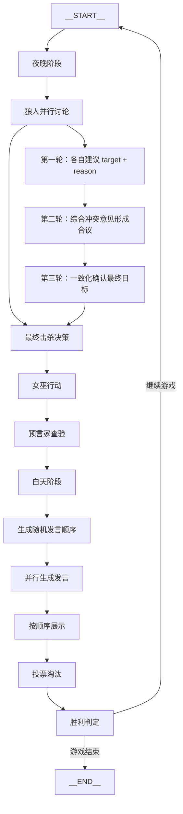

# 技术分享讲义（Markdown导出）

## 开场：Agent 设计模式与编排
- 串行（Sequential）、并行（Parallel）、循环（Loop）的核心区别与适用场景
- 示例入口与流程总览：`examples/werewolf-game/README.md:136-150`
- 状态共享与键策略：
  - 全局状态更新：`spring-ai-alibaba-graph-core/src/main/java/com/alibaba/cloud/ai/graph/OverAllState.java:263-277`
  - 初始状态构建：`spring-ai-alibaba-graph-core/src/main/java/com/alibaba/cloud/ai/graph/OverAllStateBuilder.java:167-173`

## 狼人杀示例：节点流转与三轮讨论收敛
- 夜晚阶段（Sequential）
  - 狼人并行讨论→合并意见→最终击杀决策：`examples/werewolf-game/IMPLEMENTATION_GUIDE.md:81-103`
  - 女巫行动、预言家查验串联：`examples/werewolf-game/IMPLEMENTATION_GUIDE.md:161-185`
- 白天阶段（Sequential）
  - 生成随机发言顺序→所有存活玩家并行发言→按顺序展示→投票淘汰：`examples/werewolf-game/IMPLEMENTATION_GUIDE.md:189-225`、`229-252`
- 回合循环（Loop）
  - 条件/固定轮次循环控制：`examples/werewolf-game/IMPLEMENTATION_GUIDE.md:271-296`
- 三轮讨论收敛讲解要点
  - 第一轮：各自建议 `targetPlayer + reason`（并行汇聚）
  - 第二轮：综合冲突意见形成合议（上下文合并）
  - 第三轮：一致化确认最终目标（固定迭代或条件收敛）
- 流程总览（演示页）：`examples/werewolf-game/README.md:136-150`

## 为什么选择 Graph 作为编排引擎
- 可视化与可读性
  - 生成可分享的编排图：`spring-ai-alibaba-graph-core/src/main/java/com/alibaba/cloud/ai/graph/CompiledGraph.java:608-636`
- 确定性与可测试性
  - 编译期合法性校验（节点/边/映射）：`spring-ai-alibaba-graph-core/src/main/java/com/alibaba/cloud/ai/graph/StateGraph.java:441-447`、`spring-ai-alibaba-graph-core/src/main/java/com/alibaba/cloud/ai/graph/internal/edge/Edge.java:76-104`
- 条件边与映射
  - 命令映射至目标节点：`spring-ai-alibaba-graph-core/src/main/java/com/alibaba/cloud/ai/graph/internal/edge/EdgeCondition.java:31-36`、`spring-ai-alibaba-graph-core/src/main/java/com/alibaba/cloud/ai/graph/internal/edge/EdgeValue.java:37-48`
- 并行与子图处理
  - 并行目标约束与边重写：`spring-ai-alibaba-graph-core/src/main/java/com/alibaba/cloud/ai/graph/CompiledGraph.java:140-197`
  - 子图展开与ID前缀化、边合流：`spring-ai-alibaba-graph-core/src/main/java/com/alibaba/cloud/ai/graph/CompiledGraph.java:700-781`

## Graph Runtime 设计拆解
- Reactive 执行入口与主执行器
  - 入口：`spring-ai-alibaba-graph-core/src/main/java/com/alibaba/cloud/ai/graph/GraphRunner.java:48-59`
  - 主流程：`spring-ai-alibaba-graph-core/src/main/java/com/alibaba/cloud/ai/graph/executor/MainGraphExecutor.java:56-116`
- 节点执行与下一步决策
  - 节点执行：`spring-ai-alibaba-graph-core/src/main/java/com/alibaba/cloud/ai/graph/executor/NodeExecutor.java:85-128`
  - 计算下一节点（条件边/映射）：`spring-ai-alibaba-graph-core/src/main/java/com/alibaba/cloud/ai/graph/GraphRunnerContext.java:195-218`
- 中断机制与人类介入
  - 运行时中断判定：`spring-ai-alibaba-graph-core/src/main/java/com/alibaba/cloud/ai/graph/GraphRunnerContext.java:165-180`
  - 中断返回与恢复：`spring-ai-alibaba-graph-core/src/main/java/com/alibaba/cloud/ai/graph/executor/MainGraphExecutor.java:96-106`
- 检查点与恢复
  - 运行中检查点保存：`spring-ai-alibaba-graph-core/src/main/java/com/alibaba/cloud/ai/graph/GraphRunnerContext.java:224-231`
  - 历史快照与审计：`spring-ai-alibaba-graph-core/src/main/java/com/alibaba/cloud/ai/graph/CompiledGraph.java:199-207`
- 流式输出与并行流
  - 嵌入 Flux（LLM流）：`spring-ai-alibaba-graph-core/src/main/java/com/alibaba/cloud/ai/graph/executor/NodeExecutor.java:187-293`
  - GraphFlux 流处理：`spring-ai-alibaba-graph-core/src/main/java/com/alibaba/cloud/ai/graph/executor/NodeExecutor.java:409-463`
  - ParallelGraphFlux 并行合并：`spring-ai-alibaba-graph-core/src/main/java/com/alibaba/cloud/ai/graph/executor/NodeExecutor.java:473-545`

## DeepResearch 与 Documentation 示例亮点
- DeepResearch（研究型智能体）
  - 规划与任务分解：`examples/deepresearch/README.md:48-52`
  - 文件系统工具闭环（ls/read/edit/glob/grep）：`examples/deepresearch/README.md:53-57`
  - 子智能体协作（research-agent / critique-agent）：`examples/deepresearch/README.md:58-62`
  - 拦截器与 Hook（上下文压缩/大结果转储/人工审批/工具调用限制）：`examples/deepresearch/README.md:76-88`
  - MCP/Jina 集成配置：`examples/deepresearch/src/main/resources/application.yml:7-18`
- Documentation（A2A 能力）
  - Nacos 注册/发现与服务卡片：`examples/documentation/src/main/resources/application.yml:14-36`

## 狼人杀流程图（Mermaid）

## 现场演示建议
- 图展示与代码跳转
  - 图编排生成：`spring-ai-alibaba-graph-core/src/main/java/com/alibaba/cloud/ai/graph/CompiledGraph.java:608-636`
  - 中断与恢复演示：`spring-ai-alibaba-graph-core/src/main/java/com/alibaba/cloud/ai/graph/GraphRunnerContext.java:165-180`
  - 并行与流式输出演示：`spring-ai-alibaba-graph-core/src/main/java/com/alibaba/cloud/ai/graph/executor/NodeExecutor.java:473-545`
- 讲解节奏
  - 先用流程图讲清“为什么要用图”
  - 再用狼人杀串联“并行-串行-循环”的组合
  - 最后以 DeepResearch/Documentation 强化“工程化与治理”