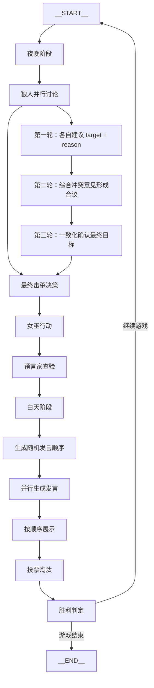

# 技术分享讲义（Markdown导出）

## 开场：Agent 设计模式与编排
- 串行（Sequential）、并行（Parallel）、循环（Loop）的核心区别与适用场景
- 示例入口与流程总览（README 片段）：
```md
1. **初始化**：随机分配角色
2. **夜晚阶段**（Sequential）
   - 狼人讨论并选择击杀目标（Multi-Agent）
   - 女巫决定是否使用药水
   - 预言家查验玩家身份
3. **白天阶段**（Sequential）
   - 生成随机发言顺序
   - 所有存活玩家并行生成发言（Parallel）
   - 按发言顺序展示
   - 投票淘汰
4. **胜利判定**：检查是否满足胜利条件
5. **循环**：重复 2-4 直到游戏结束
```
- 状态共享与键策略：
  - 全局状态更新（OverAllState.java:263-277）：
```java
public Map<String, Object> updateState(Map<String, Object> partialState) {
    Map<String, KeyStrategy> keyStrategies = keyStrategies();
    partialState.keySet().forEach(key -> {
        KeyStrategy strategy = keyStrategies != null ? keyStrategies.get(key) : null;
        if (strategy == null) {
            strategy = KeyStrategy.REPLACE;
        }
        if (partialState.get(key) == MARK_FOR_REMOVAL) {
            this.data.remove(key);
        } else {
            this.data.put(key, strategy.apply(value(key, null), partialState.get(key)));
        }
    });
    return data();
}
```
  - 初始状态构建（OverAllStateBuilder.java:167-173）：
```java
OverAllState state = new OverAllState(new HashMap<>(data), new HashMap<>(keyStrategies), store);
if (!state.containStrategy(OverAllState.DEFAULT_INPUT_KEY)) {
    state.registerKeyAndStrategy(OverAllState.DEFAULT_INPUT_KEY, new ReplaceStrategy());
}
return state;
```

## 狼人杀流程图（Mermaid）


## 狼人杀示例：节点流转与三轮讨论收敛
- 夜晚阶段（Sequential）
  - 狼人并行讨论→合并意见→最终击杀决策（IMPLEMENTATION_GUIDE.md:81-103）：
```java
// 使用 ParallelAgent 让所有狼人并行讨论
ParallelAgent parallelDiscussion = ParallelAgent.builder()
    .name("werewolf_parallel_discussion")
    .agents(werewolfAgents)
    .mergeStrategy(new ListMergeStrategy())
    .mergeOutputKey("werewolf_suggestions")
    .build();

// 综合所有狼人意见的最终决策 Agent
ReactAgent finalDecision = ReactAgent.builder()
    .name("werewolf_final_decision")
    .model(chatModel)
    .instruction("综合所有狼人的建议，做出最终击杀决策")
    .outputSchema("""
        {
            "targetPlayer": "最终击杀目标",
            "reason": "决策理由"
        }
    """)
    .outputKey("werewolf_kill_target")
    .build();

// 使用 SequentialAgent 串联：讨论 -> 决策
```
  - 女巫行动、预言家查验串联（IMPLEMENTATION_GUIDE.md:161-185）：
```java
public Agent buildNightPhaseAgent(WerewolfGameState gameState) {
    List<Agent> nightAgents = new ArrayList<>();
    nightAgents.add(buildWerewolfDiscussionAgent(gameState));
    if (hasAliveWitch(gameState)) {
        nightAgents.add(buildWitchAgent(gameState));
    }
    if (hasAliveSeer(gameState)) {
        nightAgents.add(buildSeerAgent(gameState));
    }
    return SequentialAgent.builder()
        .name("night_phase")
        .agents(nightAgents)
        .build();
}
```
- 白天阶段（Sequential）
  - 生成随机发言顺序→所有存活玩家并行发言→按顺序展示（IMPLEMENTATION_GUIDE.md:189-225）：
```java
public Agent buildDayDiscussionAgent(WerewolfGameState gameState) {
    List<Agent> playerAgents = new ArrayList<>();
    for (String playerName : gameState.getAlivePlayers()) {
        Player player = gameState.getPlayerByName(playerName).orElseThrow();
        ReactAgent playerAgent = ReactAgent.builder()
            .name(playerName + "_discuss")
            .model(chatModel)
            .instruction(promptConfig.getDayDiscussionSystemPrompt(
                playerName,
                player.getRole(),
                gameState.getNightSummary(),
                getPreviousSpeeches(gameState),
                gameState.getCurrentRound()
            ))
            .outputSchema("""
                {
                    "speech": "发言内容",
                    "suspectedPlayers": ["可疑玩家"]
                }
            """)
            .outputKey(playerName + "_speech")
            .build();
        playerAgents.add(playerAgent);
    }
    return ParallelAgent.builder()
        .name("day_discussion")
        .agents(playerAgents)
        .mergeStrategy(new ListMergeStrategy())
        .mergeOutputKey("all_speeches")
        .build();
}
```
  - 投票淘汰（IMPLEMENTATION_GUIDE.md:229-252）：
```java
public Agent buildVotingAgent(WerewolfGameState gameState) {
    return ReactAgent.builder()
        .name("voting")
        .model(chatModel)
        .instruction("""
            根据所有玩家的发言内容，模拟投票过程，决定谁被投票淘汰。
            考虑发言顺序的影响（后发言者可能更具说服力）。
            玩家发言：""" + formatSpeeches(gameState.getDaySpeeches()) + """
            存活玩家：""" + String.join(", ", gameState.getAlivePlayers()))
        .outputSchema("""
            {
                "votedOutPlayer": "被投票淘汰的玩家",
                "voteDetails": {"玩家": "投给谁"},
                "voteCount": {"玩家": 票数}
            }
        """)
        .outputKey("voting_result")
        .build();
}
```
- 回合循环（Loop）
  - 条件/固定轮次循环控制（IMPLEMENTATION_GUIDE.md:271-296）：
```java
public Agent buildGameLoopAgent(WerewolfGameState gameState) {
    Agent singleRound = SequentialAgent.builder()
        .name("single_round")
        .agents(List.of(
            buildNightPhaseAgent(gameState),
            buildDayPhaseAgent(gameState)
        ))
        .build();
    return LoopAgent.builder()
        .name("game_loop")
        .agent(singleRound)
        .loopMode(LoopMode.CONDITION)
        .maxLoops(config.getMaxRounds())
        .loopCondition(messages -> {
            return !gameState.isGameOver();
        })
        .build();
}
```
- 三轮讨论收敛讲解要点
  - 第一轮：各自建议 `targetPlayer + reason`（并行汇聚）
  - 第二轮：综合冲突意见形成合议（上下文合并）
  - 第三轮：一致化确认最终目标（固定迭代或条件收敛）
- 流程总览（演示页片段已贴于开场小节）

## 为什么选择 Graph 作为编排引擎
- 可视化与可读性
  - 生成可分享的编排图（CompiledGraph.java:608-636）：
```java
public GraphRepresentation getGraph(GraphRepresentation.Type type, String title, boolean printConditionalEdges) {
    String content = type.generator.generate(processedData.nodes(), processedData.edges(), title,
            printConditionalEdges);
    return new GraphRepresentation(type, content);
}
public GraphRepresentation getGraph(GraphRepresentation.Type type, String title) {
    String content = type.generator.generate(processedData.nodes(), processedData.edges(), title, true);
    return new GraphRepresentation(type, content);
}
public GraphRepresentation getGraph(GraphRepresentation.Type type) {
    return getGraph(type, "Graph Diagram", true);
}
```
- 确定性与可测试性
  - 编译期合法性校验（StateGraph.java:441-447）：
```java
public CompiledGraph compile(CompileConfig config) throws GraphStateException {
    Objects.requireNonNull(config, "config cannot be null");
    validateGraph();
    return new CompiledGraph(this, config);
}
```
  - 边合法性校验（Edge.java:76-104）：
```java
public void validate(StateGraph.Nodes nodes) throws GraphStateException {
    if (!Objects.equals(sourceId(), START) && !nodes.anyMatchById(sourceId())) {
        throw Errors.missingNodeReferencedByEdge.exception(sourceId());
    }
    if (isParallel()) {
        Set<String> duplicates = targets.stream()
            .collect(Collectors.groupingBy(EdgeValue::id, Collectors.counting()))
            .entrySet()
            .stream()
            .filter(entry -> entry.getValue() > 1)
            .map(Map.Entry::getKey)
            .collect(Collectors.toSet());
        if (!duplicates.isEmpty()) {
            throw Errors.duplicateEdgeTargetError.exception(sourceId(), duplicates);
        }
    }
    for (EdgeValue target : targets) {
        validate(target, nodes);
    }
}
```
- 条件边与映射
  - 命令映射至目标节点（EdgeCondition.java:31-36）：
```java
public record EdgeCondition(AsyncCommandAction action, Map<String, String> mappings) {
    @Override
    public String toString() {
        return format("EdgeCondition[ %s, mapping=%s", action != null ? "action" : "null", mappings);
    }
}
```
  - 映射值重写（EdgeValue.java:37-48）：
```java
if (id != null) {
    return target.apply(id);
}
var newMappings = value.mappings().entrySet().stream().collect(Collectors.toMap(Map.Entry::getKey, e -> {
    var v = target.apply(e.getValue());
    return (v.id() != null) ? v.id() : e.getValue();
}));
return new EdgeValue(null, new EdgeCondition(value.action(), newMappings));
```
- 并行与子图处理
  - 并行目标约束与边重写（CompiledGraph.java:140-197）：
```java
if (targets.size() == 1) {
    edges.put(e.sourceId(), targets.get(0));
}
else {
    Supplier<Stream<EdgeValue>> parallelNodeStream = () -> targets.stream()
        .filter(target -> nodeFactories.containsKey(target.id()));
    var parallelNodeEdges = parallelNodeStream.get()
        .map(target -> new Edge(target.id()))
        .filter(ee -> processedData.edges().elements.contains(ee))
        .map(ee -> processedData.edges().elements.indexOf(ee))
        .map(index -> processedData.edges().elements.get(index))
        .toList();
    var parallelNodeTargets = parallelNodeEdges.stream()
        .map(ee -> ee.target().id())
        .collect(Collectors.toSet());
    if (parallelNodeTargets.size() > 1) {
        var conditionalEdges = parallelNodeEdges.stream()
            .filter(ee -> ee.target().value() != null)
            .toList();
        if (!conditionalEdges.isEmpty()) {
            throw Errors.unsupportedConditionalEdgeOnParallelNode.exception(e.sourceId(),
                    conditionalEdges.stream().map(Edge::sourceId).toList());
        }
        throw Errors.illegalMultipleTargetsOnParallelNode.exception(e.sourceId(), parallelNodeTargets);
    }
    var targetList = parallelNodeStream.get().toList();
    var actions = targetList.stream()
        .map(target -> {
            try {
                return nodeFactories.get(target.id()).apply(compileConfig);
            } catch (GraphStateException ex) {
                throw new RuntimeException("Failed to create parallel node action for target: " + target.id() + ". Cause: " + ex.getMessage(), ex);
            }
        })
        .toList();
    var actionNodeIds = targetList.stream().map(EdgeValue::id).toList();
    var parallelNode = new ParallelNode(e.sourceId(), actions, actionNodeIds, keyStrategyMap, compileConfig);
    nodeFactories.put(parallelNode.id(), parallelNode.actionFactory());
    edges.put(e.sourceId(), new EdgeValue(parallelNode.id()));
    edges.put(parallelNode.id(), new EdgeValue(parallelNodeTargets.iterator().next()));
}
```
  - 子图展开与ID前缀化、边合流（CompiledGraph.java:700-781）：
```java
var sgEdgeStart = processedSubGraphEdges.edgeBySourceId(START).orElseThrow();
if (sgEdgeStart.isParallel()) {
    throw new GraphStateException("subgraph not support start with parallel branches yet!");
}
var sgEdgeStartTarget = sgEdgeStart.target();
if (sgEdgeStartTarget.id() == null) {
    throw new GraphStateException(format("the target for node '%s' is null!", subgraphNode.id()));
}
var sgEdgeStartRealTargetId = subgraphNode.formatId(sgEdgeStartTarget.id());
interruptsBefore = interruptsBefore.stream()
    .map(interrupt -> Objects.equals(subgraphNode.id(), interrupt) ? sgEdgeStartRealTargetId : interrupt)
    .collect(Collectors.toUnmodifiableSet());
var edgesWithSubgraphTargetId = edges.edgesByTargetId(subgraphNode.id());
if (edgesWithSubgraphTargetId.isEmpty()) {
    throw new GraphStateException(
            format("the node '%s' is not present as target in graph!", subgraphNode.id()));
}
for (var edgeWithSubgraphTargetId : edgesWithSubgraphTargetId) {
    var newEdge = edgeWithSubgraphTargetId.withSourceAndTargetIdsUpdated(subgraphNode, Function.identity(),
            id -> new EdgeValue((Objects.equals(id, subgraphNode.id())
                    ? subgraphNode.formatId(sgEdgeStartTarget.id()) : id)));
    edges.elements.remove(edgeWithSubgraphTargetId);
    edges.elements.add(newEdge);
}
var sgEdgesEnd = processedSubGraphEdges.edgesByTargetId(END);
var edgeWithSubgraphSourceId = edges.edgeBySourceId(subgraphNode.id()).orElseThrow();
if (edgeWithSubgraphSourceId.isParallel()) {
    throw new GraphStateException("subgraph not support routes to parallel branches yet!");
}
if (interruptsAfter.contains(subgraphNode.id())) {
    var exceptionMessage = (edgeWithSubgraphSourceId.target().id() == null) ? "'interruption after' on subgraph is not supported yet!" : format(
            "'interruption after' on subgraph is not supported yet! consider to use 'interruption before' node: '%s'",
            edgeWithSubgraphSourceId.target().id());
    throw new GraphStateException(exceptionMessage);
}
sgEdgesEnd.stream()
    .map(e -> e.withSourceAndTargetIdsUpdated(subgraphNode, subgraphNode::formatId,
            id -> (Objects.equals(id, END) ? edgeWithSubgraphSourceId.target()
                    : new EdgeValue(subgraphNode.formatId(id)))))
    .forEach(edges.elements::add);
edges.elements.remove(edgeWithSubgraphSourceId);
processedSubGraphEdges.elements.stream()
    .filter(e -> !Objects.equals(e.sourceId(), START))
    .filter(e -> !e.anyMatchByTargetId(END))
    .map(e -> e.withSourceAndTargetIdsUpdated(subgraphNode, subgraphNode::formatId,
            id -> new EdgeValue(subgraphNode.formatId(id))))
    .forEach(edges.elements::add);
processedSubGraphNodes.elements.stream().map(n -> {
    return n.withIdUpdated(subgraphNode::formatId);
}).forEach(nodes.elements::add);
```

## Graph Runtime 设计拆解
- Reactive 执行入口与主执行器
  - 入口（GraphRunner.java:48-59）：
```java
public Flux<GraphResponse<NodeOutput>> run(OverAllState initialState) {
    return Flux.defer(() -> {
        try {
            GraphRunnerContext context = new GraphRunnerContext(initialState, config, compiledGraph);
            return mainGraphExecutor.execute(context, resultValue);
        }
        catch (Exception e) {
            return Flux.error(e);
        }
    });
}
```
  - 主流程（MainGraphExecutor.java:56-116）：
```java
public Flux<GraphResponse<NodeOutput>> execute(GraphRunnerContext context, AtomicReference<Object> resultValue) {
    try {
        if (context.shouldStop() || context.isMaxIterationsReached()) {
            return handleCompletion(context, resultValue);
        }
        final var returnFromEmbed = context.getReturnFromEmbedAndReset();
        if (returnFromEmbed.isPresent()) {
            var interruption = returnFromEmbed.get().value(new TypeRef<InterruptionMetadata>() {});
            if (interruption.isPresent()) {
                return Flux.just(GraphResponse.done(interruption.get()));
            }
            return Flux.just(GraphResponse.done(context.buildNodeOutputAndAddCheckpoint(Map.of())));
        }
        if (context.getCurrentNodeId() != null && context.getConfig().isInterrupted(context.getCurrentNodeId())) {
            context.getConfig().withNodeResumed(context.getCurrentNodeId());
            return Flux.just(GraphResponse.done(GraphResponse.done(context.getCurrentStateData())));
        }
        if (context.isStartNode()) {
            return handleStartNode(context);
        }
        if (context.isEndNode()) {
            return handleEndNode(context, resultValue);
        }
        final var resumeFrom = context.getResumeFromAndReset();
        if (resumeFrom.isPresent()) {
            if (context.getCompiledGraph().compileConfig.interruptBeforeEdge()
                    && java.util.Objects.equals(context.getNextNodeId(), INTERRUPT_AFTER)) {
                var nextNodeCommand = context.nextNodeId(resumeFrom.get(), context.getCurrentStateData());
                context.setNextNodeId(nextNodeCommand.gotoNode());
                context.setCurrentNodeId(null);
            }
        }
        if (context.shouldInterrupt()) {
            try {
                InterruptionMetadata metadata = InterruptionMetadata
                    .builder(context.getCurrentNodeId(), context.cloneState(context.getCurrentStateData()))
                    .build();
                return Flux.just(GraphResponse.done(metadata));
            }
            catch (Exception e) {
                return Flux.just(GraphResponse.error(e));
            }
        }
        return nodeExecutor.execute(context, resultValue);
    }
    catch (Exception e) {
        context.doListeners(ERROR, e);
        org.slf4j.LoggerFactory.getLogger(com.alibaba.cloud.ai.graph.GraphRunner.class)
            .error("Error during graph execution", e);
        return Flux.just(GraphResponse.error(e));
    }
}
```
- 节点执行与下一步决策
  - 节点执行（NodeExecutor.java:85-128）：
```java
private Flux<GraphResponse<NodeOutput>> executeNode(GraphRunnerContext context,
        AtomicReference<Object> resultValue) {
    try {
        context.setCurrentNodeId(context.getNextNodeId());
        String currentNodeId = context.getCurrentNodeId();
        AsyncNodeActionWithConfig action = context.getNodeAction(currentNodeId);
        if (action == null) {
            return Flux.just(GraphResponse.error(RunnableErrors.missingNode.exception(currentNodeId)));
        }
        if (action instanceof InterruptableAction) {
            context.getConfig().metadata(RunnableConfig.STATE_UPDATE_METADATA_KEY).ifPresent(updateFromFeedback -> {
                if (updateFromFeedback instanceof Map<?, ?>) {
                    context.mergeIntoCurrentState((Map<String, Object>) updateFromFeedback);
                } else {
                    throw new RuntimeException();
                }
            });
            Optional<InterruptionMetadata> interruptMetadata = ((InterruptableAction) action)
                .interrupt(currentNodeId, context.cloneState(context.getCurrentStateData()), context.getConfig());
            if (interruptMetadata.isPresent()) {
                resultValue.set(interruptMetadata.get());
                return Flux.just(GraphResponse.done(interruptMetadata.get()));
            }
        }
        context.doListeners(NODE_BEFORE, null);
        CompletableFuture<Map<String, Object>> future = action.apply(context.getOverallState(),
                context.getConfig());
        return Mono.fromFuture(future)
                .flatMapMany(updateState -> handleActionResult(context, updateState, resultValue))
                .onErrorResume(error -> {
                    context.doListeners(ERROR, new Exception(error));
                    return Flux.just(GraphResponse.error(error));
                });
    }
    catch (Exception e) {
        return Flux.just(GraphResponse.error(e));
    }
}
```
  - 计算下一节点（GraphRunnerContext.java:195-218）：
```java
public Command nextNodeId(String nodeId, Map<String, Object> state) throws Exception {
    return nextNodeId(compiledGraph.getEdge(nodeId), state, nodeId);
}
private Command nextNodeId(com.alibaba.cloud.ai.graph.internal.edge.EdgeValue route, Map<String, Object> state,
        String nodeId) throws Exception {
    if (route == null) {
        throw RunnableErrors.missingEdge.exception(nodeId);
    }
    if (route.id() != null) {
        return new Command(route.id(), state);
    }
    if (route.value() != null) {
        var command = route.value().action().apply(this.overallState, config).get();
        var newRoute = command.gotoNode();
        String result = route.value().mappings().get(newRoute);
        if (result == null) {
            throw RunnableErrors.missingNodeInEdgeMapping.exception(nodeId, newRoute);
        }
        this.mergeIntoCurrentState(command.update());
        return new Command(result, state);
    }
    throw RunnableErrors.executionError.exception(format("invalid edge value for nodeId: [%s] !", nodeId));
}
```
- 中断机制与人类介入
  - 运行时中断判定（GraphRunnerContext.java:165-180）：
```java
public boolean shouldInterrupt() {
    return shouldInterruptBefore(nextNodeId, currentNodeId) || shouldInterruptAfter(currentNodeId, nextNodeId);
}
private boolean shouldInterruptBefore(String nodeId, String previousNodeId) {
    if (previousNodeId == null)
        return false;
    return compiledGraph.compileConfig.interruptsBefore().contains(nodeId);
}
private boolean shouldInterruptAfter(String nodeId, String previousNodeId) {
    if (nodeId == null || Objects.equals(nodeId, previousNodeId))
        return false;
    return (compiledGraph.compileConfig.interruptBeforeEdge() && Objects.equals(nodeId, INTERRUPT_AFTER))
            || compiledGraph.compileConfig.interruptsAfter().contains(nodeId);
}
```
  - 中断返回与恢复（MainGraphExecutor.java:96-106）：
```java
if (context.shouldInterrupt()) {
    try {
        InterruptionMetadata metadata = InterruptionMetadata
            .builder(context.getCurrentNodeId(), context.cloneState(context.getCurrentStateData()))
            .build();
        return Flux.just(GraphResponse.done(metadata));
    }
    catch (Exception e) {
        return Flux.just(GraphResponse.error(e));
    }
}
```
- 检查点与恢复
  - 运行中检查点保存（GraphRunnerContext.java:224-231）：
```java
public Optional<Checkpoint> addCheckpoint(String nodeId, String nextNodeId) throws Exception {
    if (compiledGraph.compileConfig.checkpointSaver().isPresent()) {
        var cp = Checkpoint.builder().nodeId(nodeId).state(cloneState(overallState.data())).nextNodeId(nextNodeId).build();
        compiledGraph.compileConfig.checkpointSaver().get().put(config, cp);
        return Optional.of(cp);
    }
    return Optional.empty();
}
```
  - 历史快照与审计（CompiledGraph.java:199-207）：
```java
public Collection<StateSnapshot> getStateHistory(RunnableConfig config) {
    BaseCheckpointSaver saver = compileConfig.checkpointSaver()
        .orElseThrow(() -> (new IllegalStateException("Missing CheckpointSaver!")));
    return saver.list(config)
        .stream()
        .map(checkpoint -> StateSnapshot.of(keyStrategyMap, checkpoint, config, stateGraph.getStateFactory()))
        .collect(toList());
}
```
- 流式输出与并行流
  - 嵌入 Flux（LLM流，NodeExecutor.java:187-293）：
```java
private Optional<Flux<GraphResponse<NodeOutput>>> getEmbedFlux(GraphRunnerContext context,
        Map<String, Object> partialState) {
    return partialState.entrySet().stream().filter(e -> e.getValue() instanceof Flux<?>).findFirst().map(e -> {
        var chatFlux = (Flux<?>) e.getValue();
        var lastChatResponseRef = new AtomicReference<ChatResponse>(null);
        var lastGraphResponseRef = new AtomicReference<GraphResponse<NodeOutput>>(null);
        return chatFlux.filter(element -> {
            if (element instanceof ChatResponse response) {
                return response.getResult() != null;
            }
            return true;
        })
        .doOnError(error -> {
            log.error("Error occurred in embedded Flux stream for key '{}': {}",
                e.getKey(), error.getMessage(), error);
        })
        .map(element -> {
            if (element instanceof ChatResponse response) {
                ChatResponse lastResponse = lastChatResponseRef.get();
                if (lastResponse == null) {
                    var message = response.getResult().getOutput();
                    GraphResponse<NodeOutput> lastGraphResponse = null;
                    if (message.hasToolCalls()) {
                        lastGraphResponse =
                                GraphResponse.of(context.buildStreamingOutput(message, response, context.getCurrentNodeId()));
                    } else {
                        lastGraphResponse =
                                GraphResponse.of(context.buildStreamingOutput(message, response, context.getCurrentNodeId()));
                    }
                    lastChatResponseRef.set(response);
                    lastGraphResponseRef.set(lastGraphResponse);
                    return lastGraphResponse;
                }
                final var currentMessage = response.getResult().getOutput();
                if (currentMessage.hasToolCalls()) {
                    GraphResponse<NodeOutput> lastGraphResponse = GraphResponse
                        .of(context.buildStreamingOutput(currentMessage, response, context.getCurrentNodeId()));
                    lastGraphResponseRef.set(lastGraphResponse);
                    return lastGraphResponse;
                }
                final var lastMessageText = requireNonNull(lastResponse.getResult().getOutput().getText(),
                        "lastResponse text cannot be null");
                final var currentMessageText = currentMessage.getText();
                var newMessage = new AssistantMessage(
                        currentMessageText != null ? lastMessageText.concat(currentMessageText) : lastMessageText,
                        currentMessage.getMetadata(), currentMessage.getToolCalls(), currentMessage.getMedia());
                var newGeneration = new Generation(newMessage,
                        response.getResult().getMetadata());
                ChatResponse newResponse = new ChatResponse(
                        List.of(newGeneration), response.getMetadata());
                lastChatResponseRef.set(newResponse);
                GraphResponse<NodeOutput> lastGraphResponse = GraphResponse
                    .of(context.buildStreamingOutput(response.getResult().getOutput(), response, context.getCurrentNodeId()));
                return lastGraphResponse;
            }
            else if (element instanceof GraphResponse) {
                GraphResponse<NodeOutput> graphResponse = (GraphResponse<NodeOutput>) element;
                lastGraphResponseRef.set(graphResponse);
                return graphResponse;
            }
            else {
                String errorMsg = "Unsupported flux element type: "
                        + (element != null ? element.getClass().getSimpleName() : "null");
                return GraphResponse.<NodeOutput>error(new IllegalArgumentException(errorMsg));
            }
        }).concatWith(Mono.defer(() -> {
            if (lastChatResponseRef.get() == null) {
                GraphResponse<?> lastGraphResponse = lastGraphResponseRef.get();
                if (lastGraphResponse != null && lastGraphResponse.resultValue().isPresent()) {
                    Object result = lastGraphResponse.resultValue().get();
                    if (result instanceof Map resultMap) {
                        if (!resultMap.containsKey(e.getKey()) && resultMap.containsKey("messages")) {
                            List<Object> messages = (List<Object>) resultMap.get("messages");
                            Object lastMessage = messages.get(messages.size() - 1);
                            if (lastMessage instanceof AssistantMessage lastAssistantMessage) {
                                resultMap.put(e.getKey(), lastAssistantMessage.getText());
                            }
                        }
                    }
                    return Mono.just(lastGraphResponseRef.get());
                }
                return Mono.empty();
            }
            else {
                return Mono.fromCallable(() -> {
                    Map<String, Object> completionResult = new HashMap<>();
                    completionResult.put(e.getKey(), lastChatResponseRef.get().getResult().getOutput());
                    if (!e.getKey().equals("messages")) {
                        completionResult.put("messages", lastChatResponseRef.get().getResult().getOutput());
                    }
                    return GraphResponse.done(completionResult);
                });
            }
        }));
    });
}
```
  - GraphFlux 流处理（NodeExecutor.java:409-463）：
```java
private Flux<GraphResponse<NodeOutput>> handleGraphFlux(GraphRunnerContext context,
                                                        GraphFlux<?> graphFlux, Map<String, Object> partialState,
                                                        AtomicReference<Object> resultValue) {
    String effectiveNodeId = graphFlux.getNodeId();
    AtomicReference<Object> lastDataRef = new AtomicReference<>();
    Flux<GraphResponse<NodeOutput>> processedFlux = graphFlux.getFlux()
            .map(element -> {
                lastDataRef.set(graphFlux.hasMapResult() ? graphFlux.getMapResult().apply(element) : element);
                StreamingOutput output = context.buildStreamingOutput(graphFlux, element, effectiveNodeId);
                return GraphResponse.<NodeOutput>of(output);
            })
            .onErrorMap(error -> new RuntimeException("GraphFlux processing error in node: " + effectiveNodeId, error));
    Mono<Void> updateContextMono = Mono.fromRunnable(() -> {
        Object lastData = lastDataRef.get();
        Map<String, Object> resultMap = new HashMap<>();
        resultMap.put(graphFlux.getKey(), lastData);
        Map<String, Object> partialStateWithoutGraphFlux = partialState.entrySet()
                .stream()
                .filter(e -> !(e.getValue() instanceof GraphFlux))
                .collect(Collectors.toMap(Map.Entry::getKey, Map.Entry::getValue));
        context.mergeIntoCurrentState(partialStateWithoutGraphFlux);
        if (!resultMap.isEmpty()) {
            context.mergeIntoCurrentState(resultMap);
        }
        try {
            Command nextCommand = context.nextNodeId(context.getCurrentNodeId(), context.getCurrentStateData());
            context.setNextNodeId(nextCommand.gotoNode());
            context.buildNodeOutputAndAddCheckpoint(partialStateWithoutGraphFlux);
            context.doListeners(NODE_AFTER, null);
        } catch (Exception e) {
            throw new RuntimeException(e);
        }
    });
    return processedFlux
            .concatWith(updateContextMono.thenMany(Flux.defer(() -> mainGraphExecutor.execute(context, resultValue))));
}
```
  - ParallelGraphFlux 并行合并（NodeExecutor.java:473-545）：
```java
private Flux<GraphResponse<NodeOutput>> handleParallelGraphFlux(GraphRunnerContext context,
                                                                ParallelGraphFlux parallelGraphFlux, Map<String, Object> partialState,
                                                                AtomicReference<Object> resultValue) throws Exception {
    if (parallelGraphFlux.isEmpty()) {
        return handleNonStreamingResult(context, partialState, resultValue);
    }
    Map<String, AtomicReference<Object>> nodeDataRefs = new HashMap<>();
    List<Flux<GraphResponse<NodeOutput>>> fluxList = parallelGraphFlux.getGraphFluxes()
            .stream()
            .map(graphFlux -> {
                String nodeId = graphFlux.getNodeId();
                AtomicReference<Object> nodeDataRef = new AtomicReference<>();
                nodeDataRefs.put(nodeId, nodeDataRef);
                return graphFlux.getFlux()
                        .map(element -> {
                            nodeDataRef.set(graphFlux.hasMapResult() ? graphFlux.getMapResult().apply(element) : element);
                            StreamingOutput output = context.buildStreamingOutput(graphFlux, element, nodeId);
                            return GraphResponse.<NodeOutput>of(output);
                        })
                        .onErrorMap(error -> new RuntimeException("ParallelGraphFlux processing error in node: " + nodeId, error));
            })
            .collect(Collectors.toList());
    Flux<GraphResponse<NodeOutput>> mergedFlux = Flux.merge(fluxList);
    Mono<Void> updateContextMono = Mono.fromRunnable(() -> {
        Map<String, Object> combinedResultMap = new HashMap<>();
        for (GraphFlux<?> graphFlux : parallelGraphFlux.getGraphFluxes()) {
            String nodeId = graphFlux.getNodeId();
            Object nodeData = nodeDataRefs.get(nodeId).get();
            combinedResultMap.put(graphFlux.getKey(),nodeData);
        }
        Map<String, Object> partialStateWithoutParallelGraphFlux = partialState.entrySet()
                .stream()
                .filter(e -> !(e.getValue() instanceof ParallelGraphFlux))
                .collect(Collectors.toMap(Map.Entry::getKey, Map.Entry::getValue));
        context.mergeIntoCurrentState(partialStateWithoutParallelGraphFlux);
        if (!combinedResultMap.isEmpty()) {
            context.mergeIntoCurrentState(combinedResultMap);
        }
        try {
            Command nextCommand = context.nextNodeId(context.getCurrentNodeId(), context.getCurrentStateData());
            context.setNextNodeId(nextCommand.gotoNode());
            context.buildNodeOutputAndAddCheckpoint(partialStateWithoutParallelGraphFlux);
            context.doListeners(NODE_AFTER, null);
        } catch (Exception e) {
            throw new RuntimeException(e);
        }
    });
    return mergedFlux
            .concatWith(updateContextMono.thenMany(Flux.defer(() -> mainGraphExecutor.execute(context, resultValue))));
}
```

## DeepResearch 与 Documentation 示例亮点
- DeepResearch（研究型智能体）
  - 规划与任务分解（README.md:48-52）：
```md
**🎯 Planning & Task Decomposition**
- Uses `TodoListInterceptor` to break down complex tasks into discrete steps
- Dynamically tracks progress and adapts plans as new information emerges
- Supports parallel execution of independent research subtasks
```
  - 文件系统工具闭环（README.md:53-57）：
```md
**📁 File System & Context Management**
- Provides `ls`, `read_file`, `write_file`, `edit_file`, `glob`, `grep` tools for file operations
- Automatically offloads large tool results to filesystem to prevent context window overflow
- Enables persistence of research process and results across the conversation
```
  - 子智能体协作（README.md:58-62）：
```md
**🤝 Subagent Collaboration**
- **research-agent**: Specialized for in-depth research, handles parallel sub-questions
- **critique-agent**: Reviews and improves report quality with detailed feedback
- Main agent coordinates subagents while keeping context clean and isolated
```
  - 拦截器与 Hook（README.md:76-88）：
```md
**Builtin Interceptors**
- `TodoListInterceptor`: Task list management and tracking
- `FilesystemInterceptor`: File system access control with sandboxing
- `SubAgentInterceptor`: Subagent spawning and coordination
- `ContextEditingInterceptor`: Auto-compress context (triggers at 10K tokens)
- `LargeResultEvictionInterceptor`: Auto-dump large results to files
- `ToolRetryInterceptor`: Retry logic for failed tool calls

**Builtin Hooks**
- `SummarizationHook`: Conversation history summarization (triggers at 120K tokens)
- `HumanInTheLoopHook`: Human approval for critical operations
- `ToolCallLimitHook`: Limit tool calls per run (default: 25)
```
  - MCP/Jina 集成配置（application.yml:7-18）：
```yaml
    mcp:
      client:
        enabled: true
        toolcallback:
          enabled: true
        sse:
          connections:
            jina:
              url: "https://mcp.jina.ai"
        request-timeout: 60000
```
- Documentation（A2A 能力）
  - Nacos 注册/发现与服务卡片（application.yml:14-36）：
```yaml
    alibaba:
      a2a:
        nacos:
          server-addr: ${NACOS_SERVER_ADDR:127.0.0.1:8848}
          username: ${NACOS_USERNAME:nacos}
          password: ${NACOS_PASSWORD:nacos}
          discovery:
            enabled: false
          registry:
            enabled: false
        server:
          version: 1.0.0
          card:
            name: data_analysis_agent
            description: 专门用于数据分析和统计计算的本地智能体
            provider:
              name: Spring AI Alibaba Documentation
              organization: Spring AI Alibaba
              url: https://sca.aliyun.com/ai/
              contact:
                email: dev@alibabacloud.com
```


## 现场演示建议
- 图展示与代码跳转
  - 图编排生成：`spring-ai-alibaba-graph-core/src/main/java/com/alibaba/cloud/ai/graph/CompiledGraph.java:608-636`
  - 中断与恢复演示：`spring-ai-alibaba-graph-core/src/main/java/com/alibaba/cloud/ai/graph/GraphRunnerContext.java:165-180`
  - 并行与流式输出演示：`spring-ai-alibaba-graph-core/src/main/java/com/alibaba/cloud/ai/graph/executor/NodeExecutor.java:473-545`
- 讲解节奏
  - 先用流程图讲清“为什么要用图”
  - 再用狼人杀串联“并行-串行-循环”的组合
  - 最后以 DeepResearch/Documentation 强化“工程化与治理”

## 基于 OverAllState 的消息可见性控制系统
- 目标与范围
  - 覆盖消息元数据、角色可见性、夜晚分区与保留策略、阶段摘要与全局知识
  - 接入运行时 `OverAllState`，支持实时过滤、覆盖与状态快照

- 数据模型
```java
enum MessageType { DISCUSS, ACTION, RESULT }
enum RetentionPolicy { PERMANENT, NIGHT_ONLY, PHASE_ONLY }
enum Role { WEREWOLF, VILLAGER, SEER, WITCH, HUNTER }

class GameMessage {
    String id;
    MessageType messageType;
    Role senderRole;
    int nightNumber;
    RetentionPolicy retentionScope;
    boolean isPublic;
    String content;
}

class NightSummary {
    int nightNumber;
    String summary;
}

class GlobalKnowledge {
    List<String> actionResults;
    List<String> playerStatusChanges;
    List<String> criticalEvents;
}
```

- OverAllState 键注册与状态布局
```java
OverAllState state = OverAllStateBuilder.builder()
    .addKey("night_messages", new HashMap<Integer, List<GameMessage>>(), KeyStrategy.REPLACE)
    .addKey("retention_policy", RetentionPolicy.PERMANENT, KeyStrategy.REPLACE)
    .addKey("night_summary", new HashMap<Integer, NightSummary>(), KeyStrategy.REPLACE)
    .addKey("global_knowledge", new HashMap<Role, GlobalKnowledge>(), KeyStrategy.REPLACE)
    .addKey("visibility_override", new HashMap<String, Set<Role>>(), KeyStrategy.REPLACE)
    .build();
```

- 实时消息过滤接口与默认实现
```java
interface MessageFilter {
    List<GameMessage> filter(OverAllState state, Role requesterRole, int currentNight);
}

class DefaultMessageFilter implements MessageFilter {
    public List<GameMessage> filter(OverAllState state, Role requesterRole, int currentNight) {
        Map<Integer, List<GameMessage>> nights = state.value("night_messages", Map.class).orElse(Map.of());
        Map<String, Set<Role>> overrides = state.value("visibility_override", Map.class).orElse(Map.of());
        List<GameMessage> all = new ArrayList<>();
        List<GameMessage> current = nights.getOrDefault(currentNight, List.of());
        all.addAll(current);
        return all.stream().filter(m -> {
            if (overrides.containsKey(m.id)) {
                return overrides.get(m.id).contains(requesterRole);
            }
            if (requesterRole == Role.WEREWOLF) {
                return m.senderRole == Role.WEREWOLF || m.isPublic;
            }
            return m.isPublic || m.senderRole == requesterRole;
        }).toList();
    }
}
```

- 可见性覆盖控制
```java
class VisibilityOverrideService {
    public void setVisibleForRoles(OverAllState state, String messageId, Set<Role> roles) {
        Map<String, Set<Role>> map = state.value("visibility_override", Map.class).orElse(new HashMap<>());
        map.put(messageId, roles);
        state.updateState(Map.of("visibility_override", map));
    }
    public void clear(OverAllState state, String messageId) {
        Map<String, Set<Role>> map = state.value("visibility_override", Map.class).orElse(new HashMap<>());
        map.remove(messageId);
        state.updateState(Map.of("visibility_override", map));
    }
}
```

- 消息时效管理与夜晚分区
```java
class RetentionManager {
    public void applyRetention(OverAllState state, int currentNight) {
        Map<Integer, List<GameMessage>> nights = state.value("night_messages", Map.class).orElse(new HashMap<>());
        RetentionPolicy policy = state.value("retention_policy", RetentionPolicy.class).orElse(RetentionPolicy.PERMANENT);
        List<GameMessage> current = nights.getOrDefault(currentNight, new ArrayList<>());
        List<GameMessage> filtered = current.stream().filter(m -> {
            if (m.retentionScope == RetentionPolicy.PHASE_ONLY) {
                return m.nightNumber == currentNight;
            }
            if (m.retentionScope == RetentionPolicy.NIGHT_ONLY) {
                return m.nightNumber == currentNight;
            }
            return true;
        }).toList();
        nights.put(currentNight, filtered);
        state.updateState(Map.of("night_messages", nights));
    }
    public void addNightMessage(OverAllState state, int night, GameMessage message) {
        Map<Integer, List<GameMessage>> nights = state.value("night_messages", Map.class).orElse(new HashMap<>());
        List<GameMessage> list = new ArrayList<>(nights.getOrDefault(night, new ArrayList<>()));
        list.add(message);
        nights.put(night, list);
        state.updateState(Map.of("night_messages", nights));
    }
}
```

- 狼人讨论默认时效配置
```java
GameMessage discuss = new GameMessage();
discuss.id = UUID.randomUUID().toString();
discuss.messageType = MessageType.DISCUSS;
discuss.senderRole = Role.WEREWOLF;
discuss.nightNumber = currentNight;
discuss.retentionScope = RetentionPolicy.PHASE_ONLY;
discuss.isPublic = false;
discuss.content = text;
```

- 夜晚切换摘要与全局知识生成
```java
class NightSummaryGenerator {
    public NightSummary generate(OverAllState state, int night) {
        Map<Integer, List<GameMessage>> nights = state.value("night_messages", Map.class).orElse(Map.of());
        List<GameMessage> msgs = nights.getOrDefault(night, List.of());
        String summary = msgs.stream().map(m -> m.content).collect(Collectors.joining("\n"));
        NightSummary ns = new NightSummary();
        ns.nightNumber = night;
        ns.summary = summary;
        Map<Integer, NightSummary> map = state.value("night_summary", Map.class).orElse(new HashMap<>());
        map.put(night, ns);
        state.updateState(Map.of("night_summary", map));
        GlobalKnowledge gk = buildWolfKnowledge(state);
        Map<Role, GlobalKnowledge> gks = state.value("global_knowledge", Map.class).orElse(new HashMap<>());
        gks.put(Role.WEREWOLF, gk);
        state.updateState(Map.of("global_knowledge", gks));
        return ns;
    }
    private GlobalKnowledge buildWolfKnowledge(OverAllState state) {
        GlobalKnowledge g = new GlobalKnowledge();
        g.actionResults = state.value("action_results", List.class).orElse(List.of());
        g.playerStatusChanges = state.value("player_status_changes", List.class).orElse(List.of());
        g.criticalEvents = state.value("critical_events", List.class).orElse(List.of());
        return g;
    }
}
```

- 状态快照保存与恢复
```java
Optional<Checkpoint> cp = graphRunnerContext.addCheckpoint(currentNodeId, nextNodeId);
Collection<StateSnapshot> history = compiledGraph.getStateHistory(runnableConfig);
```

- 关键集成示例（夜间结束切换点）
```java
void onNightPhaseEnd(OverAllState state, int night) {
    new RetentionManager().applyRetention(state, night);
    new NightSummaryGenerator().generate(state, night);
}
List<GameMessage> visibleForWolf = new DefaultMessageFilter().filter(state, Role.WEREWOLF, night);
List<GameMessage> visibleForVillager = new DefaultMessageFilter().filter(state, Role.VILLAGER, night);
```

- 测试验证点示例
```java
@Test
void test_role_isolation() {
    OverAllState s = OverAllStateBuilder.builder()
        .addKey("night_messages", new HashMap<Integer, List<GameMessage>>(), KeyStrategy.REPLACE)
        .addKey("visibility_override", new HashMap<String, Set<Role>>(), KeyStrategy.REPLACE)
        .build();
    RetentionManager rm = new RetentionManager();
    GameMessage m1 = new GameMessage();
    m1.id = "m1";
    m1.senderRole = Role.WEREWOLF;
    m1.messageType = MessageType.DISCUSS;
    m1.nightNumber = 1;
    m1.retentionScope = RetentionPolicy.PHASE_ONLY;
    m1.isPublic = false;
    m1.content = "x";
    rm.addNightMessage(s, 1, m1);
    List<GameMessage> forWolf = new DefaultMessageFilter().filter(s, Role.WEREWOLF, 1);
    List<GameMessage> forVillager = new DefaultMessageFilter().filter(s, Role.VILLAGER, 1);
    assert forWolf.size() == 1;
    assert forVillager.isEmpty();
}

@Test
void test_message_expiry() {
    OverAllState s = OverAllStateBuilder.builder()
        .addKey("night_messages", new HashMap<Integer, List<GameMessage>>(), KeyStrategy.REPLACE)
        .addKey("retention_policy", RetentionPolicy.PERMANENT, KeyStrategy.REPLACE)
        .build();
    RetentionManager rm = new RetentionManager();
    GameMessage m = new GameMessage();
    m.id = "m";
    m.messageType = MessageType.DISCUSS;
    m.senderRole = Role.WEREWOLF;
    m.nightNumber = 1;
    m.retentionScope = RetentionPolicy.PHASE_ONLY;
    m.isPublic = false;
    m.content = "y";
    rm.addNightMessage(s, 1, m);
    rm.applyRetention(s, 2);
    List<GameMessage> list = s.value("night_messages", Map.class).orElse(Map.of()).getOrDefault(2, List.of());
    assert list.isEmpty();
}

@Test
void test_summary_integrity() {
    OverAllState s = OverAllStateBuilder.builder()
        .addKey("night_messages", new HashMap<Integer, List<GameMessage>>(), KeyStrategy.REPLACE)
        .addKey("night_summary", new HashMap<Integer, NightSummary>(), KeyStrategy.REPLACE)
        .addKey("global_knowledge", new HashMap<Role, GlobalKnowledge>(), KeyStrategy.REPLACE)
        .build();
    RetentionManager rm = new RetentionManager();
    GameMessage a = new GameMessage();
    a.id = "a";
    a.messageType = MessageType.ACTION;
    a.senderRole = Role.SEER;
    a.nightNumber = 1;
    a.retentionScope = RetentionPolicy.NIGHT_ONLY;
    a.isPublic = true;
    a.content = "checked Bob";
    rm.addNightMessage(s, 1, a);
    NightSummary ns = new NightSummaryGenerator().generate(s, 1);
    assert ns.summary.contains("checked Bob");
}
```

## ReActAgent 设计哲学与基类体系
- 基类 Agent（核心属性与编译执行入口）：
```java
public abstract class Agent {
    protected String name;
    protected String description;
    protected CompileConfig compileConfig;
    protected volatile CompiledGraph compiledGraph;
    protected volatile StateGraph graph;
    protected Agent(String name, String description) {
        this.name = name;
        this.description = description;
    }
    public StateGraph getGraph() {
        if (this.graph == null) {
            try {
                this.graph = initGraph();
            }
            catch (GraphStateException e) {
                throw new RuntimeException(e);
            }
        }
        return this.graph;
    }
    public synchronized CompiledGraph getAndCompileGraph() {
        if (compiledGraph != null) {
            return compiledGraph;
        }
        StateGraph graph = getGraph();
        try {
            if (this.compileConfig == null) {
                this.compiledGraph = graph.compile();
            }
            else {
                this.compiledGraph = graph.compile(this.compileConfig);
            }
        } catch (GraphStateException e) {
            throw new RuntimeException(e);
        }
        return this.compiledGraph;
    }
}
```
- BaseAgent（输入/输出模式与结果键）：
```java
public abstract class BaseAgent extends Agent {
    protected String inputSchema;
    protected Type inputType;
    protected String outputSchema;
    protected Class<?> outputType;
    protected String outputKey;
    protected KeyStrategy outputKeyStrategy;
    protected boolean includeContents;
    protected boolean returnReasoningContents;
}
```
- ReactAgent（ReAct 编排与工具路由、子图作为节点）：
```java
public class ReactAgent extends BaseAgent {
    public Node asNode(boolean includeContents, boolean returnReasoningContents, String outputKeyToParent) {
        if (this.compiledGraph == null) {
            this.compiledGraph = getAndCompileGraph();
        }
        return new AgentSubGraphNode(this.name, includeContents, returnReasoningContents, outputKeyToParent, this.compiledGraph, this.instruction);
    }
}
```
```java
// ReactAgent 工具路由（模型输出到工具、工具结果返回模型）：
graph.addConditionalEdges(loopExitNode, edge_async(agentInstance.makeModelToTools(loopEntryNode, exitNode)), Map.of("tool", "tool", exitNode, exitNode, loopEntryNode, loopEntryNode));
graph.addConditionalEdges("tool", edge_async(agentInstance.makeToolsToModelEdge(loopEntryNode, exitNode)), Map.of(loopEntryNode, loopEntryNode, exitNode, exitNode));
```

## 工作流编排 Agent（Sequence/Parallel/Routing/Loop）
- FlowAgent（统一构建入口与特化策略）：
```java
public abstract class FlowAgent extends Agent {
    protected List<Agent> subAgents;
    protected StateGraph initGraph() throws GraphStateException {
        FlowGraphBuilder.FlowGraphConfig config = FlowGraphBuilder.FlowGraphConfig.builder()
            .name(this.name())
            .rootAgent(this)
            .subAgents(this.subAgents());
        return buildSpecificGraph(config);
    }
    protected abstract StateGraph buildSpecificGraph(FlowGraphBuilder.FlowGraphConfig config) throws GraphStateException;
}
```
- SequentialAgent（顺序编排）：
```java
public class SequentialAgent extends FlowAgent {
    protected StateGraph buildSpecificGraph(FlowGraphBuilder.FlowGraphConfig config) throws GraphStateException {
        return FlowGraphBuilder.buildGraph(FlowAgentEnum.SEQUENTIAL.getType(), config);
    }
    public static class SequentialAgentBuilder extends FlowAgentBuilder<SequentialAgent, SequentialAgentBuilder> {
        public SequentialAgent build() throws GraphStateException { return new SequentialAgent(this); }
    }
}
```
- ParallelAgent（并行编排与合并策略）：
```java
public class ParallelAgent extends FlowAgent {
    private final MergeStrategy mergeStrategy;
    private String mergeOutputKey;
    private final Integer maxConcurrency;
    protected StateGraph buildSpecificGraph(FlowGraphBuilder.FlowGraphConfig config) throws GraphStateException {
        config.customProperty("mergeStrategy", this.mergeStrategy);
        config.customProperty("maxConcurrency", this.maxConcurrency);
        return FlowGraphBuilder.buildGraph(FlowAgentEnum.PARALLEL.getType(), config);
    }
    public static class ParallelAgentBuilder extends FlowAgentBuilder<ParallelAgent, ParallelAgentBuilder> {
        public ParallelAgentBuilder mergeStrategy(MergeStrategy mergeStrategy) { this.mergeStrategy = mergeStrategy; return this; }
        public ParallelAgentBuilder mergeOutputKey(String mergeOutputKey) { this.mergeOutputKey = mergeOutputKey; return this; }
        public ParallelAgentBuilder maxConcurrency(Integer maxConcurrency) { this.maxConcurrency = maxConcurrency; return this; }
    }
}
```
- LlmRoutingAgent（路由编排，LLM 决策）：
```java
public class LlmRoutingAgent extends FlowAgent {
    private final ChatModel chatModel;
    protected StateGraph buildSpecificGraph(FlowGraphBuilder.FlowGraphConfig config) throws GraphStateException {
        config.setChatModel(this.chatModel);
        return FlowGraphBuilder.buildGraph(FlowAgentEnum.ROUTING.getType(), config);
    }
    public static class LlmRoutingAgentBuilder extends FlowAgentBuilder<LlmRoutingAgent, LlmRoutingAgentBuilder> {
        public LlmRoutingAgentBuilder model(ChatModel chatModel) { this.chatModel = chatModel; return this; }
    }
}
```
```java
// Routing 图构建策略（将父节点连接到子Agent的条件边）：
graph.addConditionalEdges(rootAgent.name(),
    new RoutingEdgeAction(config.getChatModel(), rootAgent, config.getSubAgents()), edgeRoutingMap);
```
- LoopAgent（循环编排，模式化策略）：
```java
public class LoopAgent extends FlowAgent {
    private final LoopStrategy loopStrategy;
    protected StateGraph buildSpecificGraph(FlowGraphBuilder.FlowGraphConfig config) throws GraphStateException {
        config.customProperty("loopStrategy", loopStrategy);
        return FlowGraphBuilder.buildGraph(FlowAgentEnum.LOOP.getType(), config);
    }
    public static class LoopAgentBuilder extends FlowAgentBuilder<LoopAgent, LoopAgentBuilder> {
        public LoopAgentBuilder subAgent(Agent subAgent) { this.subAgents = List.of(subAgent); return self(); }
        public LoopAgentBuilder loopStrategy(LoopStrategy loopStrategy) { this.loopStrategy = loopStrategy; return self(); }
        public LoopAgent build() throws GraphStateException { return new LoopAgent(this); }
    }
}
```